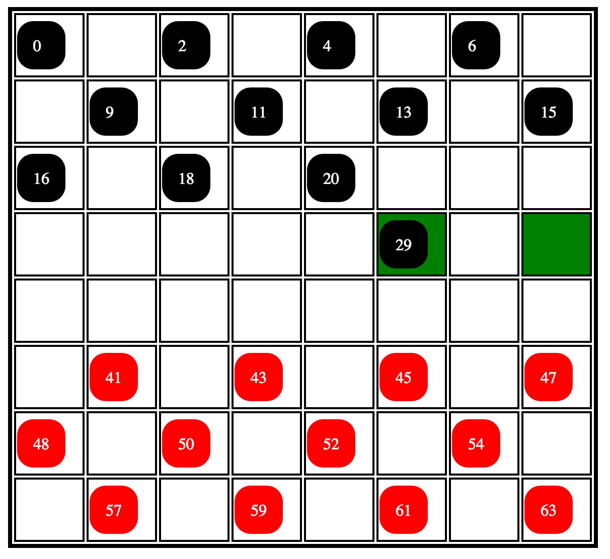
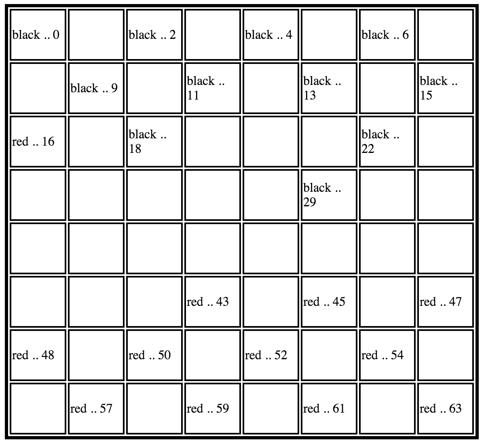

# checkers
write a basic checkers game in a time crunch as an exercise to stay sharp. command line first.

##Methodology and Process

###<i> Nov 22, 2015</i>

###Reflection

I got the double jump to work both on the front end and the back end, but i am currently unhappy with how not DRY it is. In order to check for double jumps I have to do lots of arm waving to figure out what is and is not around the chip we are intending to move. I currently have the front end figuring out if you can double jump and therefore if you cannot single jump.

I'm fairly comfortable with the separation of the frontend (application.js) ad the backend (checkers.js). Though it could be better, half the controller is just figuring out which options to show, and in doing that it I am communicating with the backend frequently. The frontend does know probably too much about the rules of checkers. This could be remedied by creating a method checkForSingleJump and a method checkForDoubleJump.


I am considering making a second backend file to separate the checker board and the chips. It might make more sense as the program becomes more complex. At the moment Checkers.js is nearly 400 lines long. Though I am certain it could be shortened through signicant DRY'ing up, but at the moment in order to keep it managable I think splitting it into two files will be the better option. When I make it so the computer can play the game, I will definitely need to create more files.

###<i> Nov 17, 2015</i>

###Reflection

I've reworked he checkers game so that it is actually following most of the rules of checkers, though I have not yet implemented the rules about kings and only moving forward. What I am discovering is that my functions for moving and jumping may not be entirely necessary. What I mean is with my added method of show options which will in turn show all the potential options for the player within the board constraints.



I'm playing around with the way that the dom communicates with the backend, and that ahs been a real learning experience so far. I had decided to pull out the case statement in the fullTurn function for a more elegant callback, but that would require the front end to know a little more about what is going on. Though I think I have improved it by having the front ed simply send whthe current selected chip location and the desired location.

I am also currently having issues with event delegation where I can't get chips to move for a second time. I was hopping this would be solved by within the function:

```javascript
  $("#board").on("click", "td", function(){
    if ($(this).hasClass("potential")) {
      moveChip($(this))
    } else {
      showOptions($(this))
    }
  })
```

where I search for the board, THEN the data, THEN the class. but that doesn't seem to be doing the trick just yet. My first priority is in properly switching turns and making both player's chips move just once. Right now I can only move black. Though it goes through full turn and switches players, it is not actually MOVING the red chips when you select a new spot. But it is changing turns. It is doing this weird thing where it looks at ALL the switch statements, meaning I probably need to reread information about switch.

###<i> Nov 12, 2015</i>

### Reflection

At this point, I have set up the basic rules of the game, and
have connected it to the view in the very basic sense. I still need to get event recongnition. My natrual instinct is to do it all Jquery and JS, but this might be an opportunity to use a front end framework.



I have 2 ideas for methods to connect the user's click actions to the backend
 - take the input chip value and automatically identify where legal options would be - potentially even showing the user where legal options. This would do all of the logic upon the first click, identifying a type of move option in the class of the grid cell and inputting the information for the full turn right from the off.
 - allowing the player to select thier chip and their desired location AND THEN doing the logic.

I think the former option would be best.

### Rules not accounted for:

 - Kings - Right now logic has it that all chips can move in any direction, though I am currently not sure if a checkers chip can move sideways... Shoot. I just realized I set up all my rules wrong.
